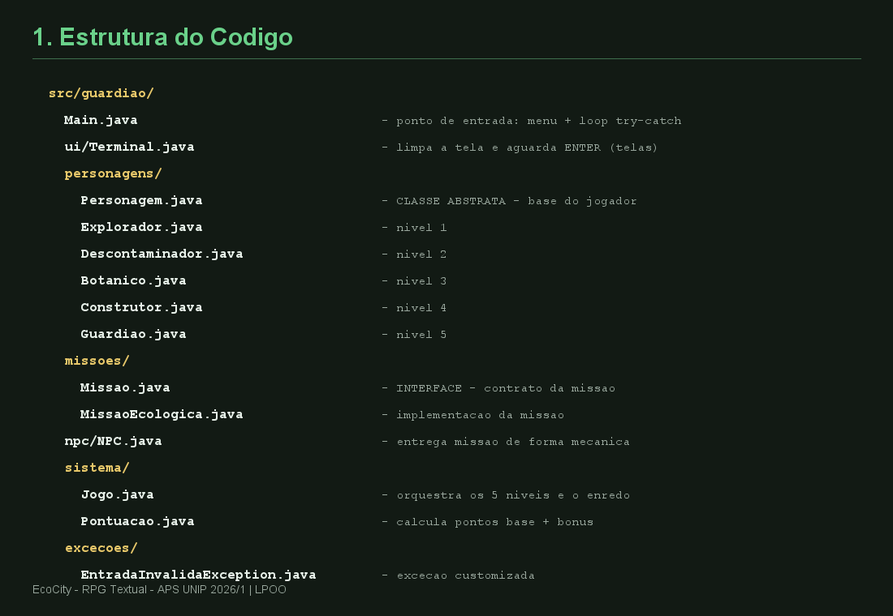
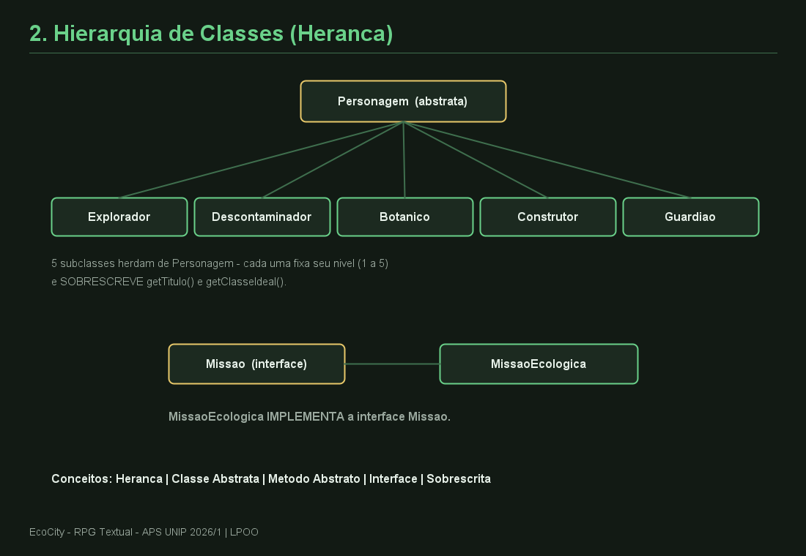
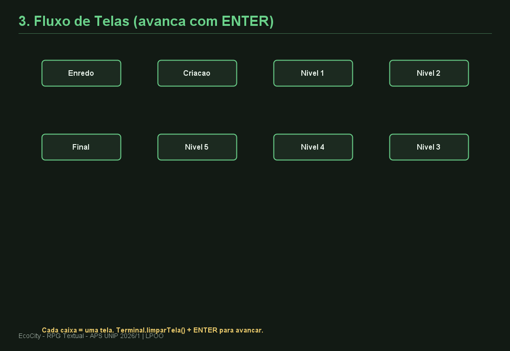
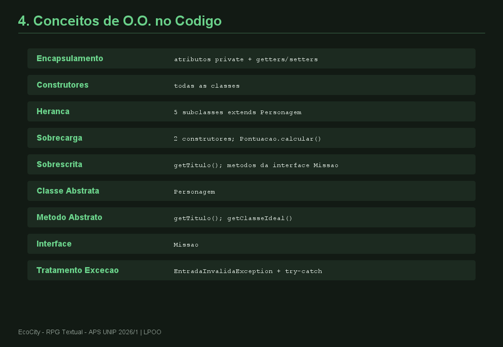

# Relatório — Estrutura do Código | EcoCity

RPG textual Java, APS UNIP 2026/1 — LPOO. Roda no console.

---

## 1. Estrutura

14 arquivos `.java` em `src/guardiao/`, divididos por pacote (responsabilidade):

| Pacote | Função |
|--------|--------|
| `(raiz)` | `Main.java` — entrada, menu, loop `try-catch` |
| `ui` | `Terminal.java` — limpa tela, aguarda ENTER |
| `personagens` | `Personagem` (abstrata) + 5 subclasses (nível 1 a 5) |
| `missoes` | `Missao` (interface) + `MissaoEcologica` |
| `npc` | `NPC.java` — entrega missão de forma mecânica |
| `sistema` | `Jogo.java` (orquestra 5 níveis) + `Pontuacao.java` |
| `excecoes` | `EntradaInvalidaException.java` |

---

## 2. Hierarquia de Classes

- `Personagem` é **classe abstrata** — molde do jogador.
- `Explorador`, `Descontaminador`, `Botanico`, `Construtor`, `Guardiao`
  **herdam** de `Personagem`. Cada uma fixa seu nível e **sobrescreve**
  `getTitulo()` e `getClasseIdeal()`.
- `Missao` é **interface**; `MissaoEcologica` a **implementa**.

---

## 3. Fluxo de Telas

8 telas. `Terminal.limparTela()` limpa o console e `aguardarEnter()`
pausa — cada nível avança para uma tela nova ao pressionar ENTER:

`Enredo → Criação → Nível 1 → 2 → 3 → 4 → 5 → Final`

---

## 4. Conceitos de O.O.

Todos marcados com comentários no código fonte:
Encapsulamento, Construtores, Herança, Sobrecarga, Sobrescrita,
Classe Abstrata, Método Abstrato, Interface, Tratamento de Exceções.

---

## 5. Regras do Jogo

- 5 níveis. Nível N tem **N missões** e **N NPCs** (1 missão por NPC).
- Total: 15 missões.
- Pontuação: base `nível × 100` + bônus de eficiência (+50) +
  bônus de classe ideal (`nível × 25`).
- NPC: interação direta, sem conscientização.
- Objetivo: chegar ao título **Guardião da Natureza**.

---

*Prints gerados em `relatorio/saida/`. Reproduzir: `javac GerarPrints.java && java GerarPrints`*
